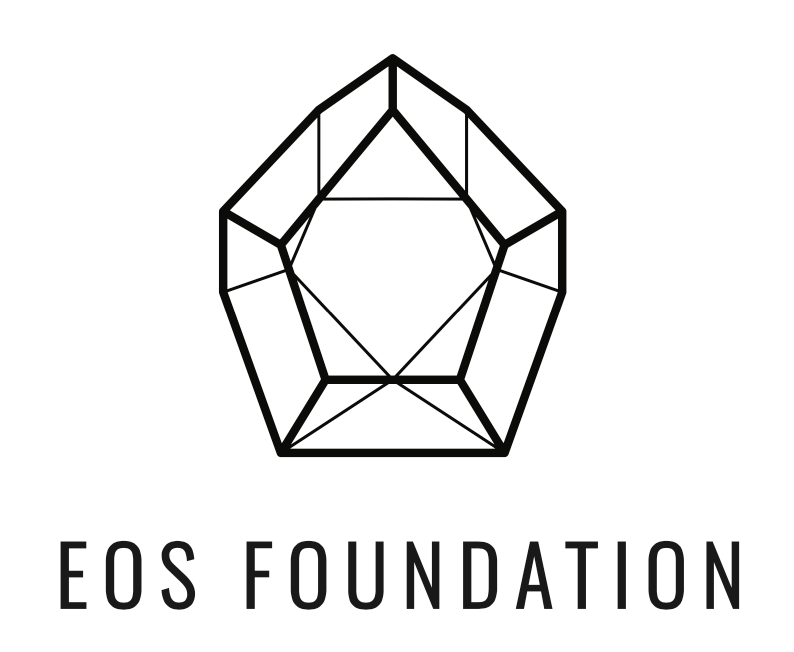
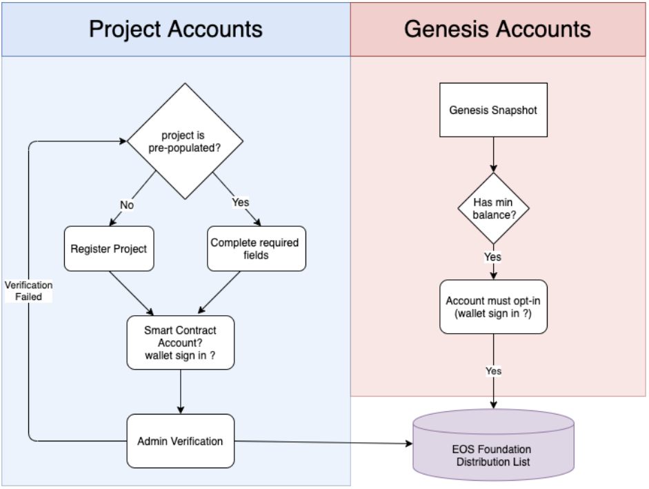

 
  
  
  

# Value Receipt Model & Distribution Web Application

**Our objective as a community is to produce the initial value receipt distribution list for founding members of the EOS foundation.**

Two types of accounts qualify as candidates

1- Genesis accounts with more than 10 EOS (we can set this to whatever makes most sense)

2- Project accounts that have registered by completing all the required fields in the web application. 

Accounts will be given a reasonable time period to register and opt-in by signing in to the app using a wallet.

 
  
  
  

### Recognizing Those Who Got Us Here with the Foundation token

The EOS Foundation will recognize the talented individuals that contributed in so many ways to making the EOS blockchain what it is today. Via a non-transferable governance token, the Foundation will empower members to source and distribute resources for the enhancement of the EOS blockchain and ecosystem. 

## EOS Community Contributors   
While EOSIO was built by Block.One, the EOS blockchain was launched by hundreds of distributed individuals and organizations around the world. With unique motivations, this group banded together in June of 2018 to launch what would become one of the most valuable blockchain platforms to date. Since then, countless contributions have been made in the name of making the EOS blockchain more valuable for all, and only a fraction of those have been rewarded or even recognized.

The EOS Foundation will proudly shine a light on these talented people via the Foundation token so that the EOS community can come to know who is helping EOS succeed, and so that community members may feel acknowledged and motivated to support the ecosystem in various and important ways. While tokens will also be for sale, and these capital contributions critical to development and thus recognized, each week the EOS Foundation will publish a handful of contributors that should be honored for their accomplishments in helping any corner of the EOS ecosystem thrive. In appreciation of their hard work, honorees will receive tokens and become members in good standing of the EOS Foundation. Once the EOS Foundation is fully activated, it will begin collecting donations and proposals, and allowing members to vote on the prioritization and distribution of resources towards various activities. It is fitting that those who have contributed time, energy and talents in the past, will be able to participate in this community effort alongside those contributing capital in the present. All types of contribution are critical for the success of EOS.

The (interim) EOS Foundation Steering Committee has been compiling an extensive list of individuals and organizations to recognize, and is asking the community for further nominations. Be sure to submit your potential honorees, including yourself, using this web application.

## Project Administrators
Projects will undergo admin verification in order to validate project information is correct and complete. It is also important to avoid duplicate projects from registering.

Required project info is :
 - Project name
 - Project description
 - mainnet account
 - opt-in / scatter-login

Projects can be asked to provide a telegram or wechat handle to validate imformation. This data will remain private and visible only to admins.

All administrator users will be made public.
Volunteer administrator users will be able to sign up.

## Tech Stack 
- Initial prototype will be made on Ruby on Rails 
- React Web App frontend will follow

### Internationalization
We are interested in help translating this project to Chinese / Korean.

## Roadmap:

#### Phase II

 - Publish Readme 
 - Create Project backlog -7 days  
 - Publish App 30 - 45 days
 - Allow for new projects to register
 - Select admin users 
 - Terms and conditions / constitution
 - Allow for reasonable registration period (45 - 60 days)
 - Produce initial distribution list

#### Phase II

- DAC /DAO 
- Genesis stewards
- Distribute Tokens 
- Donation model for value receipts 
- Project Ratings / Upvote projects?

